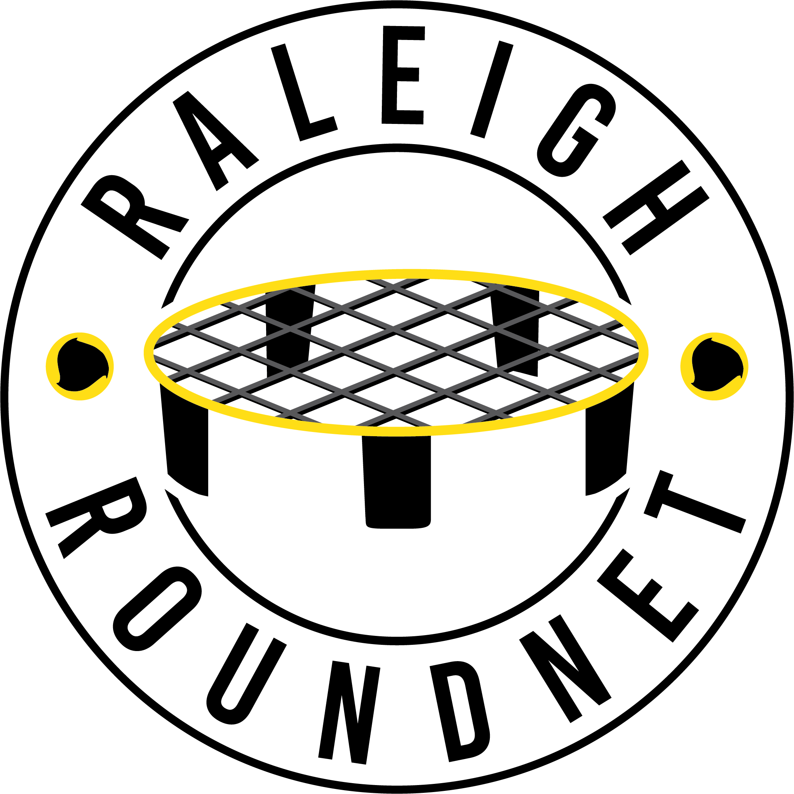

  

<h1 align="center">
  Raleigh Roundnet
</h1>

Raleigh Roundnet website for displaying information about the club and tournaments
FInd the site at [raleigh-roundnet.herokuapp.com](https://raleigh-roundnet.herokuapp.com)

## How to Set Up the Local Environment

1.  **Clone to a local directory**

2.  **In terminal, install dependencies and start local server**
    npm install
    npm i -g gatsby-cli
    npm run start

2.  **Open 'htpps://localhost:8000' to check out your local version of the site**

